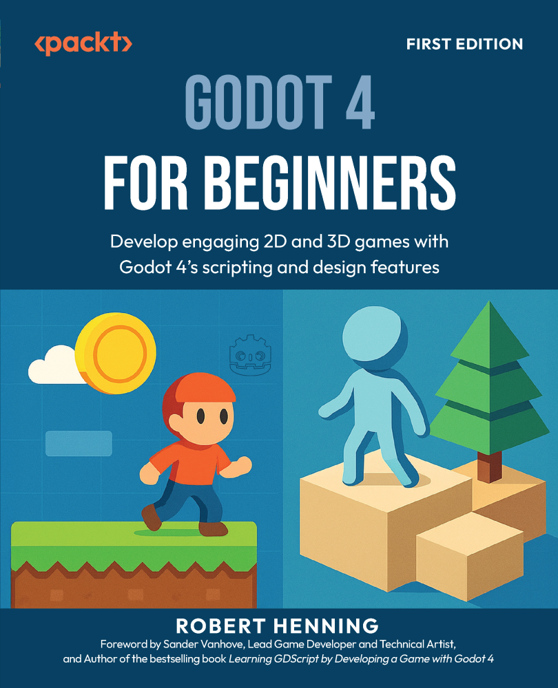

<h1 align="center">
Godot 4 for Beginners, First Edition</h1>

This is the code repository for <a href ="https://www.packtpub.com/en-us/product/godot-4-for-beginners-first-edition-9781836203094"> Godot 4 for Beginners, First Edition</a>, published by Packt.

<h2 align="center">
Develop engaging 2D and 3D games with Godot 4's scripting and design features
</h2>

Robert Henning

   
  &#8287;&#8287;&#8287;&#8287;&#8287;
  
 &#8287;&#8287;&#8287;&#8287;&#8287;
  
  &#8287;&#8287;&#8287;&#8287;&#8287;
   
  &#8287;&#8287;&#8287;&#8287;&#8287;

 
  
<h2>About the book

Jumping into Godot 4 as a beginner can be overwhelming. You’re wrestling with a new interface, trying to wrap your head around how nodes and scenes work, and learning GDScript all at once. After years of teaching game development and creating YouTube tutorials, Robert Henning knows exactly where you’re likely to have those “wait, what?” moments. He’s built this guide to systematically address those challenges head-on, breaking down complex concepts into digestible steps.

You’ll start by setting up Godot 4 and understanding its interface and tools. Then, you’ll dive into nodes and scenes—Godot’s way of organizing everything—which sounds intimidating but is actually quite intuitive. From there, you’ll explore both 2D and 3D game creation, adding key elements such as players, enemies, collectibles, and lighting effects that make your game pop visually. You’ll also get hands-on with Godot’s scripting language, GDScript, to bring your game ideas to life.

By the end of this Godot 4 book, you’ll have the skills to build complete 2D and 3D games from scratch, covering everything from level design and game state management to score tracking and more. Whether you’re just getting started or are ready to level up, this book will help you turn your ideas into fully playable games.

 
  
<h2>Key Learnings

<ul>

<li>Navigate and master the Godot 4 interface effectively</li>

<li>Utilize nodes and scenes for structured game development</li>

<li>Create dynamic 2D and immersive 3D game environments</li>

<li>Manipulate lighting to enhance game visuals</li>

<li>Script game mechanics using GDScript</li>

<li>Implement key elements such as players, enemies, and collectibles</li>

<li>Design engaging levels and manage game states</li>

</ul>

  

 
  
<h2>Chapters

     
<ol>

  <li>Let's Get Godot-ing!</li>

  <li>Exploring the Godot Engine Interface</li>

  <li>Introduction to 3D</li>

  <li>Scripting with GDScript</li>

  <li>Understanding Vectors</li>

  <li>Creating a 2D Mini-Game in Godot – Part 1</li>

  <li>Creating a 2D Mini-Game in Godot – Part 2</li>

  <li>Creating a 3D Mini-Game in Godot – Part 1</li>

  <li>Creating a 3D Mini-Game in Godot – Part 2</li>

  <li>Adding Game Juice</li>

  <li>Understanding Game Design</li>

  <li>Where to Next?</li>

</ol>

  
<h2>Requirements for this book</h2>

To fully engage with the exercises and examples provided in this book, you will need to download and install **Godot Engine 4.3**. This version of the engine introduces key features and updates that are essential for understanding and implementing the techniques we cover. Whether you’re new to Godot or have experience with earlier versions, it’s important to work with version 4.3 to ensure compatibility with the projects and concepts discussed throughout this book.

| Software/Hardware Covered in the Book | Operating System Requirements |
|---------------------------------------|--------------------------------|
| Godot Engine 4.3                      | Windows, macOS, or Linux       |

You can easily download Godot Engine 4.3 from the [official website](https://godotengine.org). While version **4.4.1** is now available, using **4.3** is recommended for full compatibility with the examples in this book. That said, everything should continue to work as expected in the latest version. The installation process is straightforward, and the engine is available on Windows, macOS, and Linux. 

Be sure to follow the instructions for your operating system, and once it is installed, familiarize yourself with the interface using Chapter 1. By using the same tools and environment that we explore in this book, you will have the best learning experience and will be able to follow along with the code examples smoothly.

    

 
  
<h2>Get to know Author</h2>

_Robert Henning_ holds an Honours Degree in Education and has over 20 years of Computer Science education experience, specializing in game development. He has taught game development using Scratch, Java with GreenFoot, Delphi, and Godot. A passionate advocate for Godot, Robert has promoted this platform since the early versions.
Robert runs a popular YouTube channel offering tutorials and showcasing games made with Godot. His hands-on approach and dedication to accessible learning have earned him a reputation as a trusted educator. "Godot 4 for Beginners" is a culmination of his expertise, designed to guide newcomers through creating their own games with clear, step-by-step instructions.

 
  
<h2>Other Related Books</h2>

<ul>

  <li><a href="https://www.packtpub.com/en-us/product/game-development-patterns-with-godot-4-first-edition-9781835880289">Game Development Patterns with Godot 4, First Edition</a></li>

  <li><a href="https://www.packtpub.com/en-us/product/learning-gdscript-by-developing-a-game-with-godot-4-first-edition-9781804616987">Learning GDScript by Developing a Game with Godot 4, First Edition</a></li>
 
</ul>

